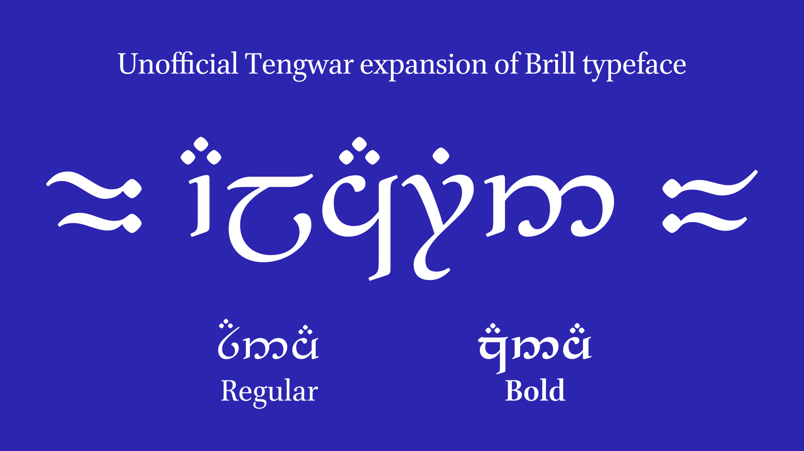

# Alcarin Tengwar

Alcarin Tengwar is a Tengwar typeface designed to pair well with the [Brill](https://www.brill.com/brill-typeface) typeface; Tengwar is an fictional writing system invented by J.R.R. Tolkien, used in his Lord Of The Rings works.

It is designed to look more typographic and of high quality, with academic context in mind. It works best with Brill, but can work with other roman typefaces. More detailed design notes can be seen [here](https://tosche.net/fonts/alcarin-tengwar).

The word 'alcarin' means 'brilliant' in the Quenya language, the High-Elven language by J.R.R. Tolkien.

Alcarin Tengwar is released under Open Font License 1.1.

## Contents
- Font Source: Glyphs 2 font source file as well as GlyphsData.xml to be installed in the ~/Library/Application Support/Glyphs 3/Info folder. [Further reading](https://glyphsapp.com/learn/roll-your-own-glyph-data)
- Fonts Static: OTF and web font versions. OTFs are autohinted, so are the OTF-based web fonts, but TTFs aren't due to the ttfautohint error with this source file.
- Fonts Variable: variable fonts in TTF and web font formats.
- Mak Keyboard Layout: My custom keyboard layout for macOS that is based on [FreeTengwar's tengwarQWERTY](http://freetengwar.sourceforge.net/keylayouts.html). It should appear as 'tengwarQWERTY Toshi'.
- README: This document.
- OFL.txt: The Open Font License 1.1 license text.
- PDFs: Some PDFs including the glyph set, manual, and simple specimens.
- Sample Text: Try the font with these text. (Note: the font doesn't contain Latin)

## Disclaimer
The Brill fonts are owned by Koninklijke Brill NV. They are not licensed under the OFL but under licenses of their own, both [non-commercial](https://brill.com/page/BrillFont/brill-typeface) and [commercial](https://fonts.ilovetypography.com/superfamily/Brill).

Alcarin Tengwar is not in any official way associated with either Koninklijke Brill NV or Tolkien Estate (though I have received the blessing of the former; not 100% unofficial). It also does not contain any graphical elements of Brill.

Also, I am a typeface designer, not a linguist. My knowledge on Tengwar and is rusty; if/when you raise issues, I would appreciate an attitude and vocabulary as if you would explain to a newbie.
